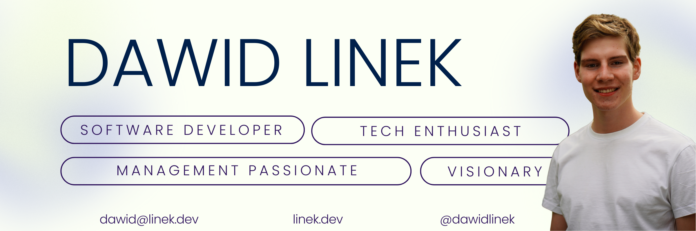

## Hi there, I`m Dawid 👋

 
 

I`m a software engineer who is passionate about new technologies, endless frontiers of IT, and the possibilities of the future. I swiftly sail across a vast sea of accessible frameworks, languages, and solutions. My primary stack is PHP Laravel, but I've smeared much much more. Noticing that in most cases the mission and the final goal is more important than code alone I've also developed myself in the areas of business development, long-term strategy, and management. I deeply believe that with the right tools and directions, every problem can be solved and a better future built.

## I've worked with

## Latest endevours and future plans

    
<b>OLX Notifier - in progress</b>

    

    Full stack app for tracking offers of intrest on hand-to-hand marketplace (like ebay). Implements historical data analisis, live notifications, machine learning offer analisis and some more. Build with Laravel.
    laravel + shack ui? + ml + docker - olx notifier
    

    
<b>Github Starer - concept phaze</b>

    

    To solve practical problem in KN Solvro organization I`m planing to create a simple solution where every member of some organization can authorize with github and automaticlly give stars to all of the organization repozitories.
    

    
<b>Personal website - concept phaze</b>

    

    Build with next.js and react simple website for showcasing myself. Implements another project regarding AI portfolio maching. 
    

    
<b>Portfolio macher - concept phaze</b>

    

    Using the newest natural language processing technology I plan to create a backend AI solution to enable potential persons of interest to pinpoint the exact expertise adequate to the requirements.

    
<b>Part of exceptional team at Unlimitech</b>

    

    I currently dedicate my commercially available time to working within a dynamic and innovative team that pushes the boundaries of e-commerce, data integrations, warehouse management systems, high online traffic solutions, and more. At a company with approximately 20 employees, I have the opportunity to engage in work at various levels. This ranges from business requirements planning and system design architecture to operational development, primarily using PHP and Laravel (alongside some projects in Node.js), as well as long-term strategic program planning and executing new company directions. You can find more on <a href="https://www.linkedin.com/company/unlimitech-pl/mycompany">Unlimitech Linkedin </a>.
    

    
<b> Chairman of the student organization - 2024/2025</b>

    

    KN Solvro is the biggest student association working at Wrocław University of Science and Technology working in areas of frontend, backend, mobile, and machine learning. Currently, I have the honor to be the Chairman of the Executive Board leading a frontier-breaking organization comprised of 70 ambitious and talented developers, designers, engineers, project manageres, and other passionates. This amazing journey is expanding my expertise in leadership, strategic thinking, and indirect multi-project management. You can find more about us on our website <a href="https://solvro.pwr.edu.pl/"> solvro.pwr.edu.pl</a>
    

    
<b> Backend-devops course in adonis.js</b>

    

    As socialy active person I belive that kwlonage should be shared freely, espacialy when it can inspire new generation of people. That's why as part of my work in KN Sovlro I've created and conducted 3 months backend course with elements of system design and devops to on one hand help inspire and start the journy for starting developers and on the other hand to expand specific knwolage and acute the discussion about the more advanced topics across our more expirient members. Materials are available on [KN Solvro blog](https://solvro.pwr.edu.pl/blog/) and [github](https://github.com/solvro/backend-course).
    

## A little bit of stats

## Get in touch
#### Always open to discussing ideas, propositions, and anything else, more about me [linek.dev](linek.dev) (in progresss) and you can catch me through [dawid@linek.dev](mailto:dawidlinek@op.pl) or [linkedin](www.linkedin.com/in/dawid-linek-0581a5323) (todo) 🥰
