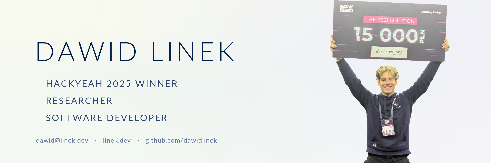
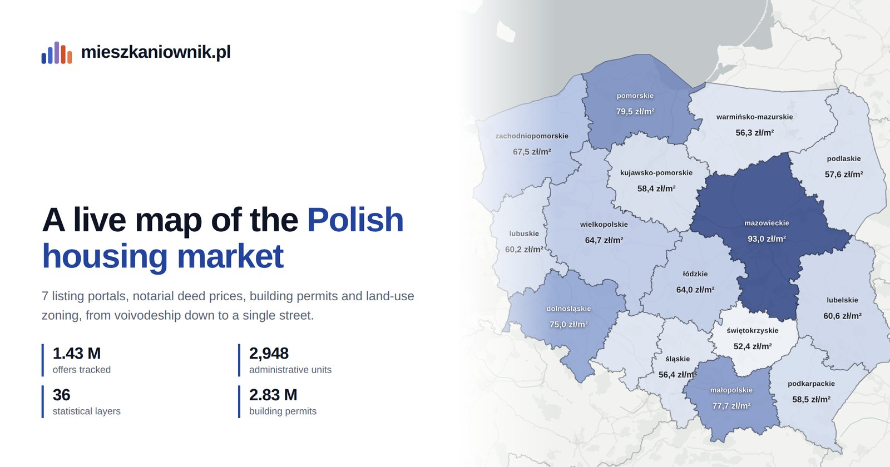
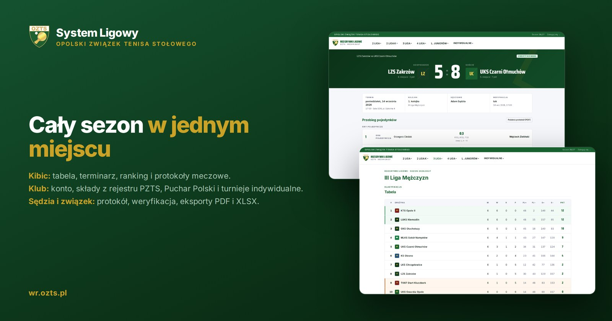
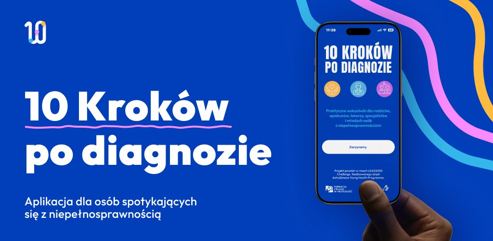
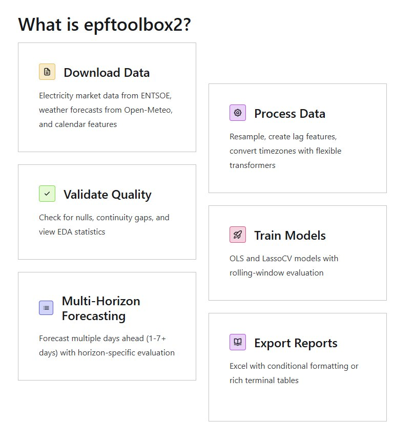
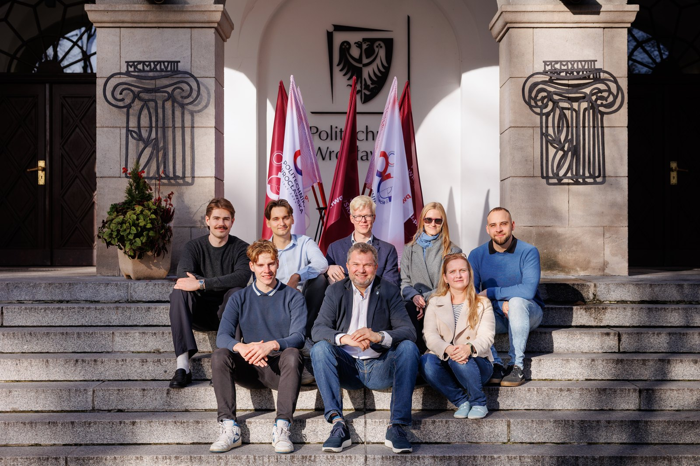
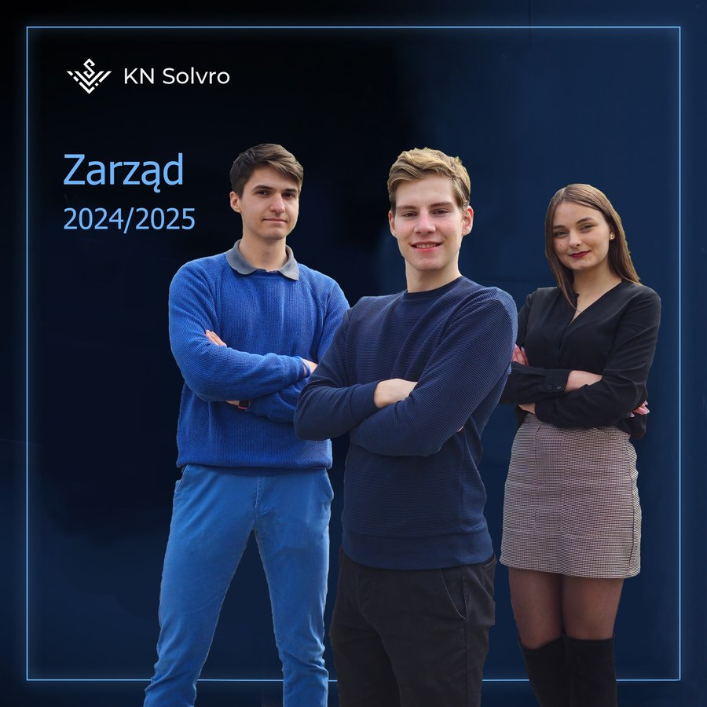

I combine five years of IT experience with a passion for software architecture,
team leadership and machine learning research. Whether I am scaling backend
systems for 60,000 users, running a 100+ person tech organisation, or forecasting
electricity demand on supercomputers, I focus on delivering real-world impact.
I am also the winner of Europe's largest programming contest, HackYeah 2025.

## Working on recently

<b>Mieszkaniownik</b> · a live map of the Polish housing market: 7 portals, 1.4M offers

 

Listing portals, notarial deed prices, building permits and land-use zoning,
from voivodeship down to a single street. 2,948 administrative units, 36
statistical layers, 2.83M building permits. Continuous ingestion with
field-level change history kept over years, and cross-source matching of
listings to a single physical property.

[Read more](https://linek.dev/project/mieszkaniownik) ·
[mieszkaniownik.pl](https://mieszkaniownik.pl)

<b>System Ligowy</b> · a whole table tennis season in one place

 

Seasons, divisions and matches for the Opole table tennis association.
Protocols scored live, tables, player rankings, squads from the PZTS register,
PDF and XLSX exports, four roles with separate panels.

[Read more](https://linek.dev/project/system-ligowy) ·
[wr.ozts.pl](https://wr.ozts.pl)

<b>10 Kroków po diagnozie</b> · life after a diagnosis in ten steps

 

An accessibility-first app for people meeting disability, with interactive
quizzes and a FireCMS-powered content backend. Built for Fundacja Celując
w Przyszłość.

[Read more](https://linek.dev/project/10-krokow-po-diagnozie) ·
[App Store](https://apps.apple.com/pl/app/10-krok%C3%B3w-po-diagnozie/id6762076419) ·
[Google Play](https://play.google.com/store/apps/details?id=com.celujacwprzyszlosc.dziesiec_krokow)

<b>epftoolbox2</b> · electricity price forecasting library, published on PyPI

 

A complete rewrite of the academic
[epftoolbox](https://github.com/jeslago/epftoolbox), rebuilt as composable
pipelines rather than scripts. Data sources for ENTSO-E, Open-Meteo and
calendar features, plus transformers, validators, models, evaluators and
exporters that assemble into data and model pipelines defined in YAML, so an
experiment can be saved, reloaded and rerun. Built-in request caching and
process-based parallelism.

[Read more](https://linek.dev/project/epf-toolbox-2) ·
[PyPI](https://pypi.org/project/epftoolbox2/) ·
[Repository](https://github.com/dawidlinek/epftoolbox2) ·
[Documentation](https://dawidlinek.github.io/epftoolbox2/)

<b>PRIORITY</b> · seven-day electricity load forecasts on HPC infrastructure

 

PRobabilistic mid- and long-term prIce fORecasting In electriciTY markets, an
international DFG-NCN project run jointly by prof. Rafał Weron in Wrocław and
prof. Florian Ziel in Essen. Machine learning models in Python, with data
integrated from ENTSO-E and Open-Meteo.

[Read more](https://linek.dev/project/priority) ·
[Project page](https://kbo.pwr.edu.pl/en/research/research-projects/dfg-ncn-2021-43-i-hs4-02578-2/)

## Previously

<b>Unlimitech</b> · lead backend, architect and DevOps, 2020 to January 2026

 

E-commerce software house. I owned the technical vision for the product
portfolio.

- **QuickSend**, comprehensive e-commerce support software: three years as
  architect and lead backend developer. Warehouse handling, shipping documents,
  subscriptions, data deduplication, fiscalisation
- **Better Traffic**, traffic queueing trusted by Universal Music, Stage24 and
  Abilet, handling 60,000+ concurrent users during premieres
- **ApexWMS**, a warehouse management system from scratch, including the mobile
  app for Zebra scanners
- **StockSynch**, stock synchronisation from many supplier sources, millions of
  products a day
- **Integrations 2.0**, a year-long programme of 30+ integration projects for
  around 20 clients, leading a team of five
- Infrastructure migration covering 100+ applications, cutting running costs by
  70 to 80%

Integrations with BaseLinker, Zalando, AtomStore, Google Feed and others.
PHP/Laravel, Node.js with AdonisJS, Vue.js, SQL, queues, CI/CD.

<b>KN Solvro</b> · president and head of backend, 2024 to 2025

 

President of the executive board of the largest student research group at
Wrocław University of Science and Technology. The organisation grew from about
20 people to over 120 across nine technical sections, with a budget above
100,000 PLN and four external grants, and was named Strategic Student Society
2025.

As head of backend: 20+ engineers, one standard stack across seven products at
once, and training for 250+ students. Course materials are on the
[Solvro blog](https://solvro.pwr.edu.pl/pl/blog) and
[GitHub](https://github.com/solvro/backend-course).

## Get in touch

Always open to discussing ideas and propositions.
[dawid@linek.dev](mailto:dawid@linek.dev) ·
[linek.dev](https://linek.dev) ·
[LinkedIn](https://www.linkedin.com/in/dawid-linek-0581a5323)
